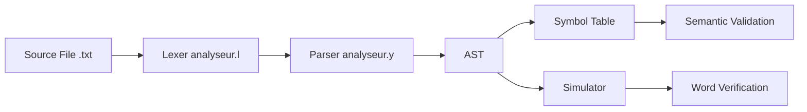

#  AFD Compiler

A **lexical analyzer** for a custom **AFD (Automate Fini Déterministe / Deterministic Finite Automaton)** description language, built with **Flex** for the Theory of Languages and Compilation course at **Université Abdelmalek Essaadi - ENSAH**.

[](https://en.wikipedia.org/wiki/C_(programming_language))
[](https://github.com/westes/flex)
[](LICENSE)

---

##  Overview

This project implements a **lexical scanner** that tokenizes source code written in a custom domain-specific language (DSL) for defining deterministic finite automata. The language allows users to specify automata components including states, alphabets, transitions, and verification rules in a clean, human-readable syntax.

**Author**: Yazid TAHIRI ALAOUI  
---

##  Features

- **Complete Lexical Analysis** - Tokenizes all language constructs
- **Error Detection** - Reports unknown characters with line numbers
- **Comment Support** - Handles single-line comments starting with `#`
- **Identifier Recognition** - Validates state and automaton names
- **Symbol Classification** - Distinguishes keywords, operators, and delimiters

---

## Language Specification

### Keywords
| Keyword | Description |
|---------|-------------|
| `automate` | Define an automaton |
| `alphabet` | Specify input symbols |
| `etats` | Define states |
| `initial` | Set the initial state |
| `finaux` | Define accepting/final states |
| `transitions` | Define state transitions |
| `verifier` | Verify words (planned) |

### Symbols
| Symbol | Meaning |
|--------|---------|
| `{ }` | Braces for blocks/sets |
| `;` | Statement terminator |
| `,` | Element separator |
| `:` | Transition separator |
| `=` | Assignment operator |
| `->` | Transition arrow |
| `"` | Quotation marks |
| `#` | Comment prefix |

### Syntax Rules
- **Identifiers**: Must start with a letter, followed by letters or digits `[a-zA-Z][a-zA-Z0-9]*`
- **Comments**: Lines starting with `#` are ignored
- **Whitespace**: Spaces and tabs are ignored

---

## Example

Here's a sample automaton description (`exemple.txt`):

```
# Simple DFA example
automate MonAutomate1 { 
    alphabet = {a, b, c};
    etats = {q0, q1, q_final};
    
    initial = q0;
    finaux = {q_final};
    
    transitions = { 
        q0:a->q1;  
        q1:b->q_final; 
        q_final:c->q0; 
    };
}
```

This defines an automaton that:
- Accepts alphabet symbols: `a`, `b`, `c`
- Has states: `q0`, `q1`, `q_final`
- Starts at state `q0`
- Accepts at state `q_final`
- Transitions form a cycle: q0 →ᵃ q1 →ᵇ q_final →ᶜ q0

---

## Getting Started

### Prerequisites
- **Flex** (Fast Lexical Analyzer)
- **GCC** (GNU Compiler Collection)

### Build Instructions

1. **Clone the repository**
   ```bash
   git clone https://github.com/SatushiNakamot0/afd-compiler.git
   cd afd-compiler
   ```

2. **Generate the lexer**
   ```bash
   flex analyseur.l
   ```

3. **Compile the generated C code**
   ```bash
   gcc lex.yy.c -lfl -o analyseur
   ```

4. **Run the analyzer**
   ```bash
   ./analyseur
   ```

   The program reads from `exemple.txt` by default and outputs token classifications.

### Expected Output

```
MOT_CLE : automate
IDENTIFIANT : MonAutomate1
SYMBOLE : {
MOT_CLE : alphabet
AFFECTATION : =
SYMBOLE : {
IDENTIFIANT : a
VIRGULE : ,
IDENTIFIANT : b
VIRGULE : ,
IDENTIFIANT : c
SYMBOLE : }
SYMBOLE : ;
...
```

---

## Project Structure

```
afd-compiler/
├── analyseur.l                      # Flex lexer specification (source)
├── lex.yy.c                         # Generated C code from Flex
├── analyseur.exe                    # Compiled executable
├── exemple.txt                      # Sample AFD description
├── README.md                        # This file
├── Propositions d'améliorations.txt # Improvement suggestions
└── resultat_commande.png            # Screenshot of execution
```

---

## Project Architecture



### Components

| Component | File | Description |
|-----------|------|-------------|
| **Lexer** | `analyseur_enhanced.l` | Tokenization with column tracking |
| **Parser** | `analyseur.y` | Syntax analysis with Bison |
| **Token Definitions** | `tokens.h` | Token codes for parser |
| **Symbol Table** | `symbol_table.c/h` | Identifier storage & validation |
| **AST** | `ast.c/h` | Abstract syntax tree structures |
| **Simulator** | `simulateur.c/h` | DFA execution engine |

---

## Build & Compilation

### Prerequisites
- **GCC** (GNU Compiler Collection)
- **Flex** (Fast Lexical Analyzer)
- **Bison** (GNU Parser Generator)

### Quick Start

#### Full Compiler (Recommended)
```bash
make                    # Build complete compiler
./compilateur_afd exemple.txt
```

#### Simple Lexer Only
```bash
make simple             # Build lexer-only version
./analyseur_simple
```

#### Run Tests
```bash
make test              # Compile and test with exemple.txt
```

### Manual Compilation

If you don't have `make`:

```bash
# Generate parser
bison -d analyseur.y

# Generate lexer  
flex analyseur_enhanced.l

# Compile all
gcc -Wall -g -o compilateur_afd \
    analyseur.tab.c lex.yy.c \
    symbol_table.c ast.c simulateur.c \
    -lfl
```

---

## Features Implemented

### ✅ Phase 1: Enhanced Lexical Analysis
- **Column Tracking** - Precise error positions (line + column)
- **Token Return Codes** - Integration-ready for parser
- **String Handling** - Pattern matching for quoted strings `"..."`
- **Improved Errors** - Detailed error messages with position

### ✅ Phase 2: Syntax Analysis
- **Bison Parser** - Complete grammar for AFD language
- **AST Construction** - Tree structure for automaton representation
- **Syntax Validation** - Catches structural errors in source

### ✅ Phase 3: Semantic Analysis
- **Symbol Table** - Hash table for identifier storage
- **Duplicate Detection** - Prevents redefinition of states/automata
- **Reference Validation** - Ensures states exist before use in transitions/finals
- **Scope Management** - Proper identifier tracking

### ✅ Phase 4: Automaton Simulation
- **DFA Simulator** - Execute automaton on input words
- **Step-by-Step Execution** - Visual transition tracking
- **Word Verification** - Accept/reject decision with trace
- **Interactive Mode** - Test multiple words interactively

---

## Usage Examples

### Basic Analysis
```bash
$ ./compilateur_afd exemple.txt

=== Compilateur AFD - Analyse Complète ===

Automate défini: MonAutomate1
Alphabet défini avec 3 symboles
États définis: 3 états
État initial: q0
États finaux: 1 états
Transitions définies: 3 transitions

=== Analyse syntaxique réussie! ===
Automate: MonAutomate1
```

### Word Verification
```bash
➤ Mot à vérifier: ab
🔍 Vérification du mot: "ab"
━━━━━━━━━━━━━━━━━━━━━━━━━━━━━━━━━━
▶️  État initial: q0

   q0 --a--> q1
   q1 --b--> q_final

✅ ACCEPTÉ - État final: q_final

➤ Mot à vérifier: abc
🔍 Vérification du mot: "abc"
━━━━━━━━━━━━━━━━━━━━━━━━━━━━━━━━━━
▶️  État initial: q0

   q0 --a--> q1
   q1 --b--> q_final
   q_final --c--> q0

❌ REJETÉ - État q0 n'est pas final
```

### Error Detection

**Syntax Error:**
```
ERREUR SYNTAXIQUE [ligne 5, col 12]: État initial 'q9' non défini dans etats
```

**Lexical Error:**
```
ERREUR a la ligne 8, colonne 15 : Caractère inconnu '&'
```

---

## Development Roadmap

### Current Status
- ✅ **Phase 1**: Lexical Analysis (Complete)
- ✅ **Phase 2**: Syntax Analysis (Complete)
- ✅ **Phase 3**: Semantic Analysis (Complete)
- ✅ **Phase 4**: Automaton Simulation (Complete)

### Future Enhancements

1. **Advanced Features**
   - Support for ε-transitions (NFA)
   - Subset construction (NFA → DFA)
   - Minimization algorithms

2. **Visualization**
   - Export to GraphViz DOT format
   - Generate state diagram images
   - Web-based interactive visualizer

3. **Optimization**
   - Dead state elimination
   - Unreachable state detection
   - Transition table optimization

4. **Extended Language Features**
   - Regular expression input
   - Named transitions
   - Comments in transition blocks
   - Multiple automata in one file

---

## Testing

### Creating Custom Automata

Create a `.txt` file with your AFD description following the syntax:

```
automate MyDFA {
    alphabet = {a, b};
    etats = {q0, q1, q2};
    initial = q0;
    finaux = {q2};
    transitions = {
        q0:a->q1;
        q1:b->q2;
    };
}
```

### Running Tests

```bash
# Build the compiler
make

# Test with your file
./compilateur_afd your_automaton.txt

# Quick test with example
make test
```

### Interactive Word Verification

After successful compilation, the simulator enters interactive mode:

```
➤ Mot à vérifier: ab
✅ ACCEPTÉ

➤ Mot à vérifier: ba
❌ REJETÉ

➤ Mot à vérifier: quit
👋 Au revoir!
```

### Automated Testing

Create test cases:

```bash
# test_cases.sh
echo "Testing automaton compilation..."
./compilateur_afd exemple.txt

# Add more test automata
./compilateur_afd test_automate1.txt
./compilateur_afd test_automate2.txt
```

---

## Learning Resources

This project demonstrates concepts from:
- **Formal Languages** - Regular expressions, finite automata, DFA/NFA theory
- **Compiler Design** - Lexical analysis, syntax analysis, semantic analysis
- **Flex/Lex** - Pattern matching, scanner generation, token streams
- **Bison/Yacc** - Context-free grammars, parser generators, AST construction
- **Data Structures** - Hash tables (symbol table), trees (AST), linked lists
- **Algorithms** - DFA simulation, state transitions, hashing

---

## Contributing

This is an educational project, but suggestions and improvements are welcome! Feel free to:
- Open an issue for bugs or questions
- Submit a pull request with enhancements
- Share alternative implementations

---

## License

This project is open source and available for educational purposes.

---

## Author
Yazid TAHIRI ALAOUI  

---

## Acknowledgments

### Course Information
- **Course**: Théorie des langages et compilation
- **Institution**: ENSAH - École Nationale des Sciences Appliquées d'Al Hoceima
- **University**: Université Abdelmalek Essaadi
- **Assignment**: TP2 - Analyseur Lexical (Enhanced with TP3+ bonus features)

### Tools & Technologies
- **Flex** - The Fast Lexical Analyzer
- **Bison** - GNU Parser Generator
- **GCC** - GNU Compiler Collection
- **Make** - GNU Build Automation

### Project Evolution
- **TP2 (Basic)**: Lexical analyzer with token recognition
- **TP2+ (Enhanced)**: Complete compiler with parser, symbol table, and DFA simulator
- **All improvements** from `Propositions d'améliorations.txt` successfully implemented

---

## 📊 Project Statistics

- **Total Files**: 17 (11 new implementation files)
- **Lines of Code**: ~1,400 (new additions)
- **Compilation Phases**: 4 (Lexical → Syntax → Semantic → Simulation)
- **Languages Used**: C, Flex, Bison, Makefile
- **Comment Language**: Moroccan Darija (Arabizi script)

---

## 📚 Additional Resources

- [USAGE_GUIDE.md](USAGE_GUIDE.md) - Detailed usage instructions
- [Propositions d'améliorations.txt](Propositions d'améliorations.txt) - Original improvement proposals
- [exemple.txt](exemple.txt) - Sample automaton file
